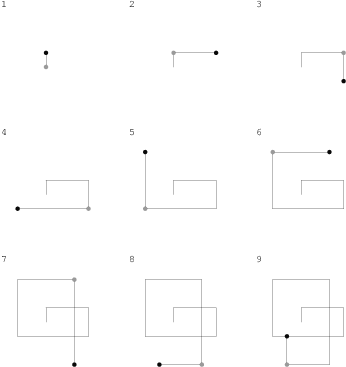

A non-empty zero-indexed array A consisting of N positive integers is given.

A LOGO turtle stands at (0,0) heading North. It moves A[0] steps forward and
turns by 90 degrees clockwise. Then it moves A[1] steps forward and turns
clockwise by 90 degrees. And so on.

For example, given:
```
  A[0] = 1  A[1] = 3  A[2] = 2
  A[3] = 5  A[4] = 4  A[5] = 4
  A[6] = 6  A[7] = 3  A[8] = 2
```

The turtle walks as follows:
```
  (0,0)   -> (0,1)     1st move, 1 step  North
  (0,1)   -> (3,1)     2nd move, 3 steps East
  (3,1)   -> (3,-1)    3rd move, 2 steps South
  (3,-1)  -> (-2,-1)   4th move, 5 steps West
  (-2,-1) -> (-2,3)    5th move, 4 steps North
  (-2,3)  -> (2,3)     6th move, 4 steps East
  (2,3)   -> (2,-3)    7th move, 6 steps South
  (2,-3)  -> (-1,-3)   8th move, 3 steps West
  (-1,-3) -> (-1,-1)   9th move, 2 steps North
```

The figure below shows the turtle's path after each step



In the 7th and 9th moves the turtle touches its previous path, namely:

- at point (2,1) in the 7th move,
- at point (2,-1) in the 7th move,
- at point (-1,-1) in the 9th move

Write a function:
```
function solution(A);
```
that, given a description of the turtle's walk in array A, returns the number
of the first move in which the turtle touches its previous path,
or 0 if no such situation occurs.

For example, given array A as defined above, the function should return 7,
because the turtle touches its previous path at point (2,1) in the 7th move.

Assume that:
- N is an integer within the range [1..100,000];
- each element of array A is an integer within the range [1..1,000,000].

Complexity:
- expected worst-case time complexity is O(N);
- expected worst-case space complexity is O(1), beyond input storage
(not counting the storage required for input arguments).

Elements of input arrays can be modified.
